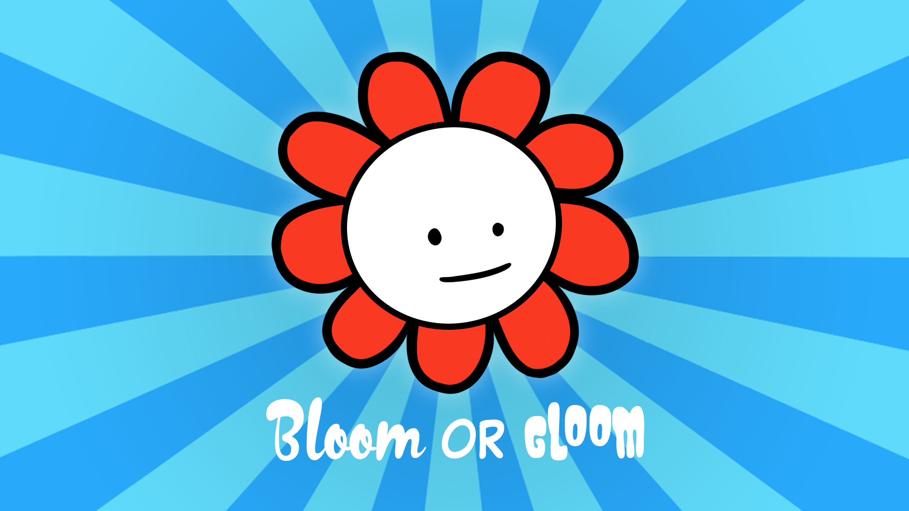

<br />
<p align="center">

  
  <a href="https://play.google.com/store/apps/details?id=fi.tuni.tamk.tiko.bloomorgloom2&hl=fi&gl=US">
    <h1 align="center">Bloom or Gloom</h1>
  </a>
  <h4 align="center">A mirror for portfolio purposes</h4>

</p>
<br />
<br />

## My part in the project
- Responsible for most of the art in the game.
- Coded / created:
  - Main clicker-game gameplay
  - Changing of the clothes and furniture
  - All animations in the home-screen

<br />
<br />

# Original README:


<br />
<p align="center">
  <a href="https://github.com/mirorauhala/bloom-or-gloom">
    
  </a>

  <h3 align="center">Bloom or Gloom</h3>

  <p align="center">
    A Game about clicking your life together.
    <br />
    <a href="https://mirorauhala.github.io/bloom-or-gloom"><strong>Read the javadoc »</strong></a>
    <br />
    <br />
    <a href="https://github.com/mirorauhala/bloom-or-gloom/actions/workflows/gradle.yml"></a>
    <a href="https://mirorauhala.github.io/bloom-or-gloom"></a>
  </p>
</p>
<br />
<br />

## Installing

```
git clone https://github.com/mirorauhala/bloom-or-gloom.git
```

### Building

Run the following commands in terminal:

```
gradlew clean
gradlew desktop:dist
gradlew :android:assembleDebug
```

Desktop `.jar` file can be found at `desktop/build/lib`.

Android `.apk` file can be found at `android/build/outputs/apk/debug`.
